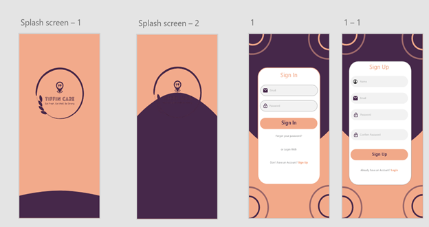
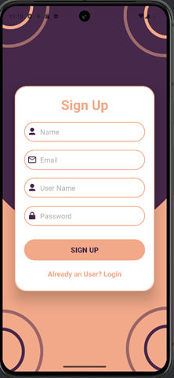
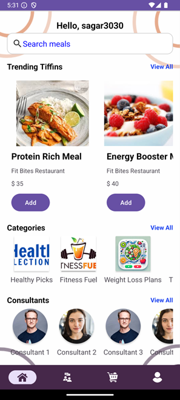
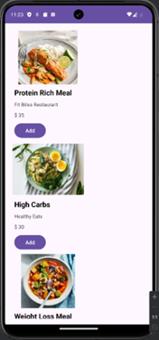
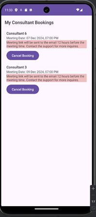
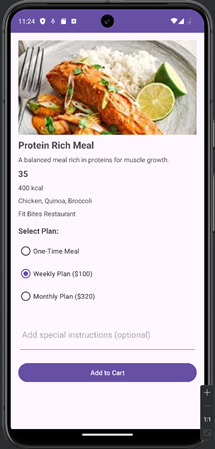
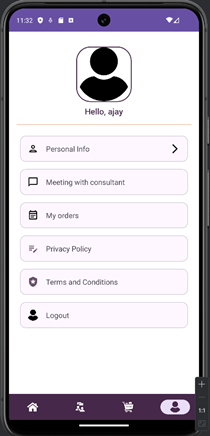

# **NutriBox Application**

## **Overview**
NutriBox is an Android-based application designed to facilitate users in ordering tiffin meals conveniently. The app integrates key functionalities like Firebase authentication and real-time database for user management, a shared preferences-based cart, and Stripe integration for seamless payment processing.

---

## **Features**
### **Authentication**
- Users can sign up and log in using Firebase Authentication.
- The app maintains the user session and fetches user-specific details from Firebase.
- Login credentials are validated using Firebase Realtime Database.

### **Cart Management**
- Users can add tiffin meals to the cart, selecting a plan (One-Time, Weekly, or Monthly).
- Cart items are stored locally using SharedPreferences for faster access.
- Users can update or remove items from the cart.

### **Payment Integration**
- Stripe API is integrated to handle payment.
- Supports test mode for demo transactions.
- Includes payment confirmation and error-handling mechanisms.
- To make payments, users need to enter their card details.
  - Card Number: 4242 4242 4242 4242
  - Expiry Date: Any future date
    - CVV: Any 3-digit number

### **User Profile**
- Displays "Hello, Username" on the Home screen.
- Shows detailed user information (Name, Email, etc.) under the personal information section.
- Implements a Logout feature to terminate the user session.

---

## **Tech Stack**
- **Programming Language:** Java
- **UI Components:** XML
- **Database:** Firebase Realtime Database
- **Payment Integration:** Stripe API
- **Data Storage:** SharedPreferences
- **Libraries:**
    - `Stripe Android SDK`
    - `Firebase Auth`
    - `Firebase Database`
    - `Google GSON`

---

## **Installation**
1. Clone the repository:
   ```bash
   git clone https://github.com/ajay-9/NutriBox.git
   cd tiffin-cart
    ```
2. Open the project in Android Studio.
3. Configure Firebase:
   a. Create a project in Firebase Console.
   b. Add your Android app and download the google-services.json file.
   c. Place the google-services.json file in the app/ directory.
4. Configure Stripe:
   a. Create an account on Stripe.
   b. Generate API keys and add them to the project.
5. Build and run the project on an Android emulator or device.

---
## **Usage**
1. Launch the app and sign up using your email and password.
2. Log in using the registered credentials.
3. Browse the available tiffin meals and add them to the cart.
4. Proceed to checkout and make a payment using the Stripe payment gateway.
5. View your order history and user profile details.
6. Log out to terminate the session.
7. Enjoy your tiffin meal!

---
## **Adobe XD Design Link**
[View the Adobe XD Designs]( https://xd.adobe.com/view/2591f084-c235-483c-a272-eb76c547b2b2-70c2/)
---
## **Screenshots**

### Landing Page
  

### Sign-Up Page
  

### Home Page
  

### Browsing Meals
  

### Managing Booking
  

### Booking a Consultant
  

### Adding Meal to Cart
  

### Profile Page
  


